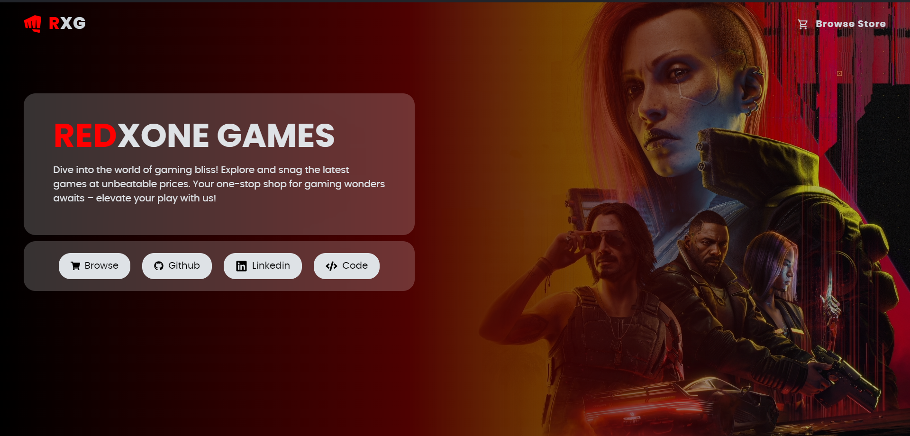

# RedXone Games Ecommerce Store

## Demo

🔴 [Live Demo](https://redxonegamex-ecommerce-store.netlify.app/)

## Features

- Simple design for easy browsing.
- Find games quickly with the search bar, find classics and the latest releases.
- Access a wide variety of games, thanks to [Rawg Api](https://rawg.io/apidocs)
- Put games you like in your shopping cart.
- Looks good on phones, tablets, and computers.
- Uses modern tech stack like React, Redux, and Sass.

## Technologies used

- ReactJs
- Redux
- Sass
- React Router
- SwiperJs

## Installation

- Clone this repository on your local machine.

- Install dependencies: `npm install`

- Start the development server: `npm run dev`

- Open your web browser and visit `http://localhost:3000` to access the application.

## License

This project is licensed under the GPL-3.0 License - see the [License](LICENSE) file for details.
